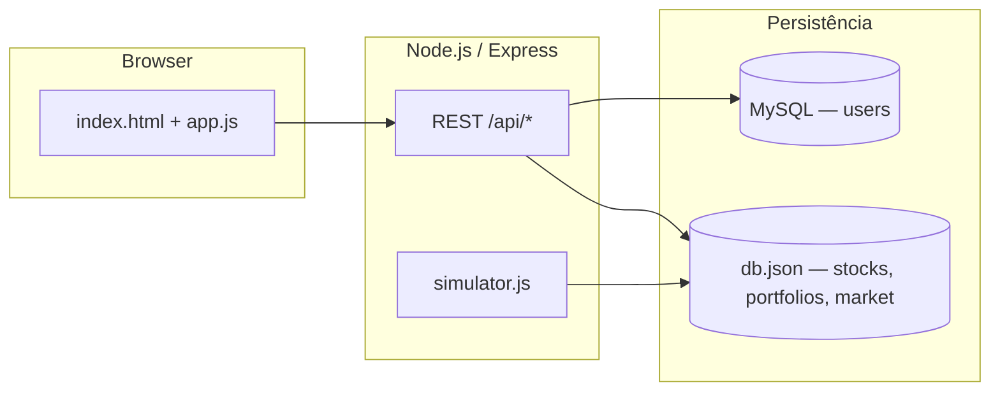

# Corleone Market

<p align="center">
  <strong>Simulador de bolsa fictícia em tempo real — negocie, dispute o ranking e comande o pregão.</strong>
</p>

<p align="center">
  
  
  
  
  
  
</p>

<p align="center">
  <em>Tema inspirado na família Corleone — mercado sério, volatilidade real e diversão competitiva.</em>
</p>

## Sobre o projeto

**Corleone Market** é uma plataforma web de simulação de mercado de capitais. Jogadores criam conta, recebem saldo inicial, compram e vendem ações com preços que mudam a cada poucos segundos, acompanham gráficos, disputam o ranking de patrimônio e podem se tornar **donos de empresas** — recebendo uma fração de cada trade realizado naquele ativo.

Ideal para:

- Aulas de educação financeira e economia
- Hackathons e portfólio full stack
- Servidores privados entre amigos
- Experimentar mecânicas de bolsa sem dinheiro real

> ⚠️ **Aviso:** projeto fictício, sem integração com mercado real ou criptomoedas. Não use para fins de investimento.

---

## Funcionalidades

### Mercado ao vivo

- Preços atualizados a cada **~2,5 s** por simulador server-side
- Índice **IBCX**, ticker contínuo, book de ofertas e gráfico (Chart.js)
- Eventos aleatórios (~90 s): escândalos, contratos, investigações
- **Mean reversion** — preços tendem a voltar ao valor de abertura
- Abertura/fechamento do pregão, crash e alta geral (admin)

### Para investidores

- Cadastro e login com sessão segura (`bcrypt` + `express-session`)
- Carteira, histórico de ordens, perfil com avatar/foto e país
- Ranking por patrimônio, demanda/oferta e volume
- Marketplace de **participação societária** (compra/venda de % de receita por trade)

### Donos de empresas

- Admin/mod pode definir **donos** ao criar ou editar um ativo
- Cada dono recebe % configurável de cada negociação naquela ação
- Botão **「Eu como dono」** para se incluir sem depender de outro usuário

### Painel administrativo

| Papel | Permissões principais |
|-------|------------------------|
| **user** | Negociar, portfólio, ranking, perfil |
| **moderator** | Abrir/fechar mercado, crash/bull, criar/editar ativos, ver usuários, ajustar saldos |
| **admin** | Tudo do mod + reset de preços, papéis, deletar usuários |
| **dev** | Backup/restore do `db.json`, relatório da database, histórico técnico |

O papel **dev** é imutável via painel (proteção no backend).

### Mobile

- Navegação inferior fixa (uso em **portrait**)
- Tabelas em formato card
- Botões e inputs com área de toque confortável

---

## Stack

| Camada | Tecnologia |
|--------|------------|
| Runtime | Node.js |
| API | Express 4 |
| Usuários | MySQL (`mysql2`) |
| Mercado / ativos | lowdb (`data/db.json`) |
| Auth | `express-session` + `bcryptjs` |
| Upload | multer |
| Frontend | HTML, CSS, JavaScript (sem framework) |
| Gráficos | Chart.js 4 |

---

## Arquitetura



---

## Início rápido

### Pré-requisitos

- **Node.js** 18+
- **MySQL** 5.6+ (ou MariaDB) com charset `utf8mb4`

### 1. Clonar e instalar

```bash
git clone https://github.com/LagBack/corleonemarket.git
cd corleonemarket
npm install
```

### 2. Configurar ambiente

```bash
cp .env.example .env
```

Edite `.env` com suas credenciais MySQL e crie o banco:

```sql
CREATE DATABASE corleone_market CHARACTER SET utf8mb4 COLLATE utf8mb4_unicode_ci;
```

### 3. Subir o servidor

```bash
npm run dev
```

Acesse: **http://localhost:3000**

Na primeira execução o projeto:

- Cria a tabela `users` e usuários demo (se vazia)
- Popula `db.json` com 8 ativos fictícios (Corleone Holdings, Godfather Tech, etc.)
- Inicia o simulador de preços

### Contas demo (seed)

| Papel | E-mail | Senha |
|-------|--------|-------|
| Admin | `corleoneadmin@email.com` | `admin123` |
| User | `usuarioteste@corleone.com` | `123456` |

Para promover um usuário a **dev** no MySQL:

```sql
ALTER TABLE users MODIFY role VARCHAR(20) NOT NULL DEFAULT 'user';
UPDATE users SET role = 'dev' WHERE email = 'seu@email.com';
```

---

## Variáveis de ambiente

| Variável | Descrição | Padrão |
|----------|-----------|--------|
| `PORT` | Porta HTTP | `3000` |
| `DB_HOST` | Host MySQL | — |
| `DB_PORT` | Porta MySQL | `3306` |
| `DB_USER` | Usuário MySQL | — |
| `DB_PASSWORD` | Senha MySQL | — |
| `DB_NAME` | Nome do banco | — |
| `RESET_DB` | Se `true`, apaga `data/db.json` ao iniciar | — |

---

## Scripts

```bash
npm start      # produção
npm run dev    # desenvolvimento (nodemon)
```

---

## API (resumo)

| Prefixo | Exemplos |
|---------|----------|
| `/api/auth` | `POST /login`, `POST /register`, `GET /me` |
| `/api/market` | `GET /state`, `POST /order`, `GET /portfolio`, `GET /ranking` |
| `/api/stocks` | `POST /` (criar), `PUT /:sym`, `DELETE /:sym` |
| `/api/users` | `PUT /me`, `POST /me/photo`, `GET /:id/public` |
| `/api/admin` | mercado, usuários, papéis, dev backup |

Todas as rotas protegidas exigem cookie de sessão (`credentials: 'include'` no frontend).

---

## Deploy

Funciona em **Render**, **Railway**, **Fly.io**, VPS, etc.

1. Provisione MySQL gerenciado (PlanetScale, Railway MySQL, etc.)
2. Defina as variáveis `DB_*` e `PORT`
3. Use `npm start` como comando de start
4. Usuários com papel **dev** podem baixar/importar `db.json` pelo painel após deploys que resetam o disco efêmero

> Em produção, altere o `secret` da sessão em `server.js` ou mova para variável de ambiente.

---

## Estrutura do repositório

```
corleonemarket/
├── server.js           # Entry point
├── routes/             # auth, market, stocks, users, admin
├── middleware/         # auth (roles)
├── data/
│   ├── db.json         # mercado (gitignored)
│   ├── simulator.js    # tick de preços
│   ├── seed.js         # ativos iniciais
│   └── mysql-seed.js   # usuários demo
└── public/
    ├── index.html
    └── js/app.js
```

---

## Contribuindo

Contribuições são bem-vindas.

1. Faça um fork
2. Crie uma branch: `git checkout -b feat/minha-feature`
3. Commit: `git commit -m "feat: descrição clara"`
4. Push e abra um Pull Request

Sugestões de melhoria: testes automatizados, WebSocket para ticks, i18n EN/PT, tema claro, Docker Compose.

---

## Licença

Projeto sob licença **MIT** — use, modifique e distribua com atribuição.

---